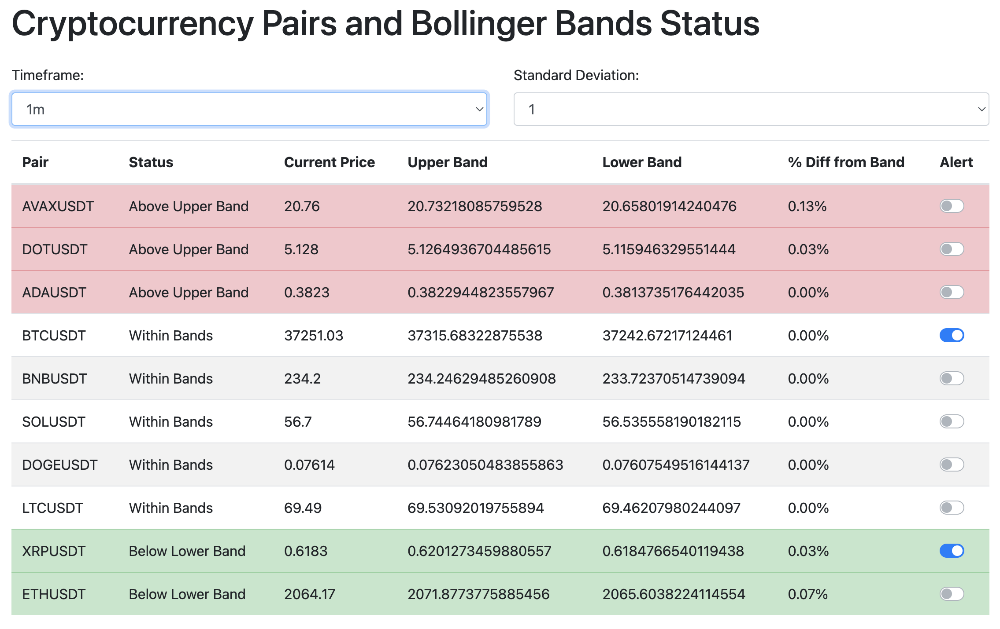

# Bollinger Bands Telegram Screener

Bollinger Bands Telegram Screener is a Flask-based web application for real-time cryptocurrency market analysis. It provides insights using Bollinger Bands and sends alerts to a Telegram bot when prices cross the Bollinger Bands.



## Features

* Real-time cryptocurrency data tracking.
* Bollinger Bands analysis for various timeframes.
* Telegram alerts for price movements across Bollinger Bands.
* Customizable settings for cryptocurrency pairs and time intervals.
* User-friendly and responsive web interface.

## Getting Started

### Prerequisites

* Python 3 and pip.
* A virtual environment is recommended for package management.

### Installation

* Clone the repository:
  ```bash
  git clone https://github.com/your-username/bollinger-bands-telegram-screener.git
  cd bollinger-bands-telegram-screener

* Install dependencies:
    ```bash
    pip install -r requirements.txt
  
###  Setting Up the Telegram Bot
- Create a bot in Telegram using BotFather and obtain the bot token.
- Get your Telegram user ID from userinfobot.
- Configure the bot token and user ID in the application's settings.

### Running the Flask Application
* Run the Flask application:
    ```bash
    python app.py
* Open your web browser and navigate to http://localhost:5000 to view the application.

### Usage
* Select desired cryptocurrency pairs and timeframes in the web interface.
* Enable or disable alerts using the toggle switch next to each pair.
* Receive real-time alerts on your Telegram bot.

### Contributing
* Contributions to improve the application are welcomed.
* Fork the repository and create your feature branch.
* Commit your changes and open a pull request.

### License
*This project is distributed under the MIT License - see the LICENSE file for details.

### Contact
https://github.com/IndiasFernandes/

